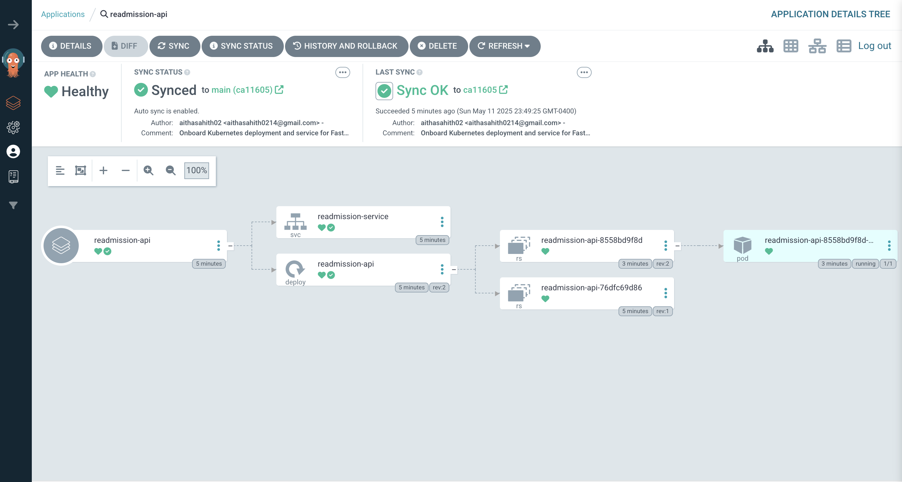

AutoMLOps: End-to-End MLOps Pipeline for Machine Learning Models
===================================================================

Welcome to **AutoMLOps**, a production-grade MLOps pipeline that automates model training, packaging, deployment, and monitoring using:

-   **FastAPI** for serving

-   **Docker** for packaging

-   **GitHub Actions** for CI/CD

-   **ArgoCD** for GitOps-based deployment

-   **Kubernetes** for orchestration

-   **Prometheus + Grafana** for observability

* * * * *

🌍 Impact
---------

AutoMLOps showcases how applied MLOps can bridge the gap between model development and deployment. With just a few commands and configuration changes, this project enables:

-   Faster iteration cycles from training to production

-   Clear reproducibility and version control

-   Real-time visibility into API health and performance

-   Scalable, portable deployments across environments

It serves as a flexible template for deploying **any machine learning model** into production with confidence, observability, and automation.

* * * * *

📊 Project Overview
-------------------

This project demonstrates how to integrate a machine learning model into a full MLOps pipeline. The example uses a stacked ensemble model trained on a sample dataset (`sklearn.datasets`), but the pipeline is model-agnostic and works with any ML workload.

It features:

-   Reproducible model training

-   Versioned model deployment via containers

-   Automated rollout using GitHub Actions + ArgoCD

-   Real-time metrics exposed to Prometheus

-   Live dashboards in Grafana

* * * * *

🔧 Tech Stack
-------------

| Component | Tool |
| --- | --- |
| Model Training | Scikit-learn, joblib |
| Serving API | FastAPI, Uvicorn |
| CI/CD | GitHub Actions |
| Deployment | Kubernetes, ArgoCD |
| Packaging | Docker |
| Monitoring | Prometheus + Grafana |

* * * * *

📚 Folder Structure
-------------------

```
automlops/
├── api/                  # FastAPI app
│   ├── main.py
│   ├── predict_pipeline.py
│   ├── requirements.txt
├── model/                # Training code and artifacts
│   ├── train_and_save.py
│   ├── test.py
│   └── artifacts/        # model.pkl, scaler.pkl, feature_columns.pkl
├── k8s/                  # K8s manifests
│   ├── deployment.yaml
│   └── service.yaml
├── argo/                 # ArgoCD Application manifest
│   └── argocd-app.yaml
├── grafana/              # Pre-built Grafana dashboards
│   └── kubernetes-metrics-dashboard.json
├── Dockerfile
└── .github/
    └── workflows/
        └── deploy.yml

```

* * * * *

🚧 Setup Instructions
---------------------

### 1\. Clone and Train the Model

```
python model/train_and_save.py

```

### 2\. Run Locally

```
uvicorn api.main:app --reload

```

Test at: <http://localhost:8000/docs>

### 3\. Build and Push Docker Image

```
docker build -t sahithaitha02/automlops-readmission-api:latest .
docker push sahithaitha02/automlops-readmission-api:latest

```

### 4\. Deploy to Kubernetes with ArgoCD




-   Edit `k8s/deployment.yaml` if using a custom tag

-   Commit and push your changes

-   ArgoCD will auto-sync or allow manual sync via UI

### 5\. Access API

```
kubectl port-forward svc/readmission-service 8000:80

```

Test again: <http://localhost:8000/predict>

* * * * *

🔢 Monitoring with Grafana
--------------------------

### Prometheus Metrics:


-   Integrated via `prometheus_fastapi_instrumentator`

-   Exposes `/metrics` endpoint for API insights

### Dashboards:

-   Use `grafana/kubernetes-metrics-dashboard.json`

-   Import it into Grafana at [http://localhost:3000](http://localhost:3000/)

* * * * *

⚙️ GitHub Actions (CI/CD)
-------------------------

File: `.github/workflows/deploy.yml`

-   Triggers on push to `main`

-   Builds & pushes Docker image

-   Can be extended to auto-update `deployment.yaml` and notify ArgoCD

* * * * *

🚜 ArgoCD GitOps Config
-----------------------

File: `argo/argocd-app.yaml`

-   Tracks your GitHub repo

-   Points to `k8s/` folder

-   Auto-deploys changes on commit

* * * * *

💬 Feedback & Contributions
---------------------------

Your thoughts and suggestions are welcome! If you have ideas to improve this project or want to contribute:
-   Feel free to connect with me on [Linkedin](https://www.linkedin.com/in/sahith-aitha-845887191/) or write me at aithasahith0214@gmail.com
-   Open an issue or PR

-   Fork the repo and extend it

-   Share your use case with us!

Thanks for exploring AutoMLOps! 🚀
